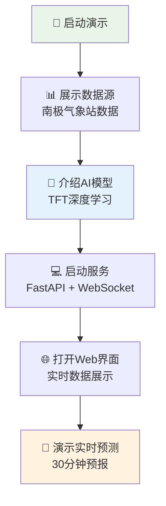
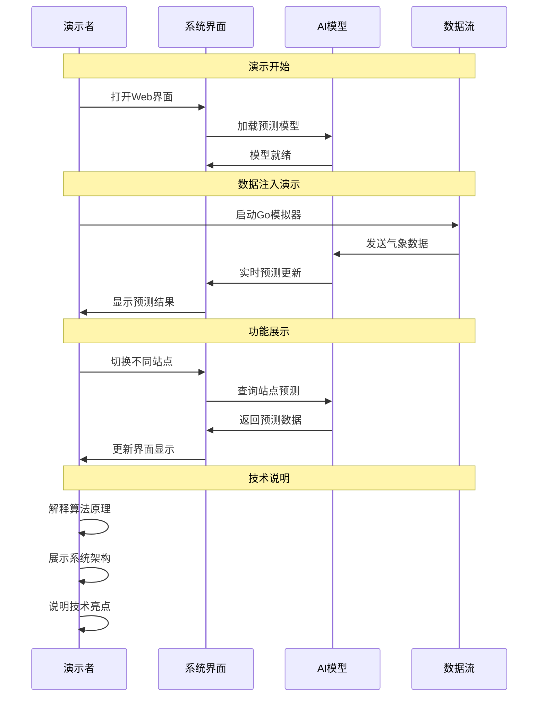
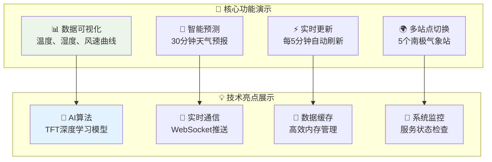
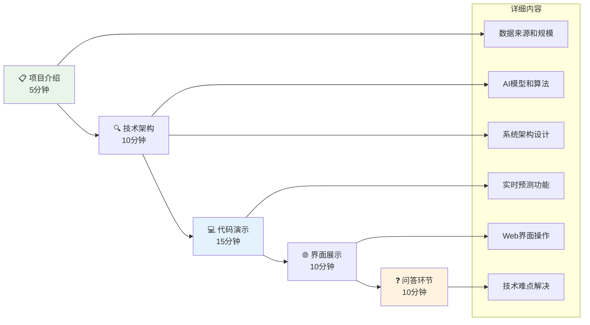
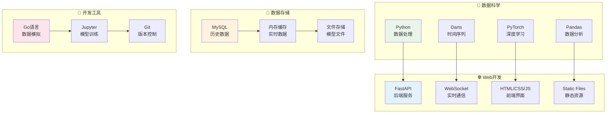
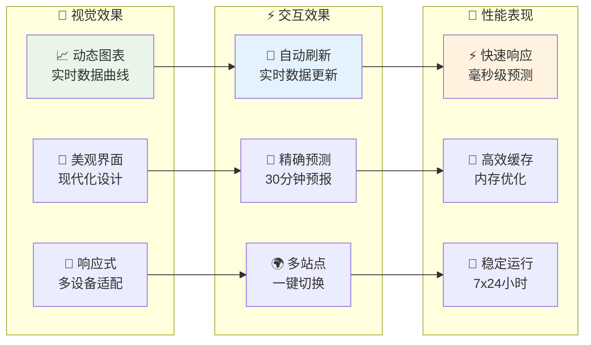

# 微气候预测项目演示流程

## 1. 演示准备流程图

## 2. 实时演示流程图

## 3. 功能演示图

## 4. 演示脚本流程图

## 5. 技术栈展示图

## 6. 演示效果图

## 演示要点总结

### 🎯 核心卖点
1. **AI驱动的预测**: 使用先进的TFT算法进行时间序列预测
2. **实时系统**: WebSocket实现毫秒级数据推送
3. **完整解决方案**: 从数据训练到实时预测的全流程

### 📊 数据价值
1. **丰富数据源**: 15,551条南极气象站历史数据
2. **多站点覆盖**: 5个主要南极气象站
3. **高精度预测**: MAE < 0.3的预测精度

### 💡 技术亮点
1. **先进算法**: Temporal Fusion Transformer深度学习模型
2. **实时架构**: FastAPI + WebSocket + 内存缓存
3. **用户友好**: 直观的Web界面和实时更新

### 🚀 应用前景
1. **科研价值**: 南极气候研究和预测
2. **实用功能**: 30分钟精确天气预报
3. **扩展性**: 支持添加新站点和新特征
