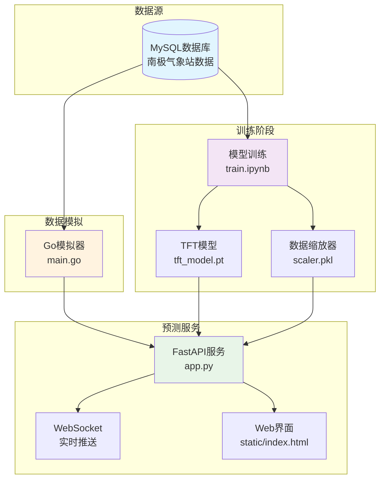
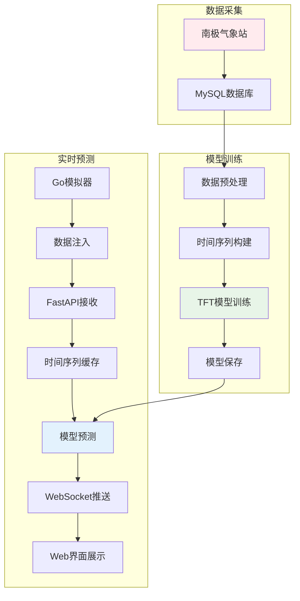
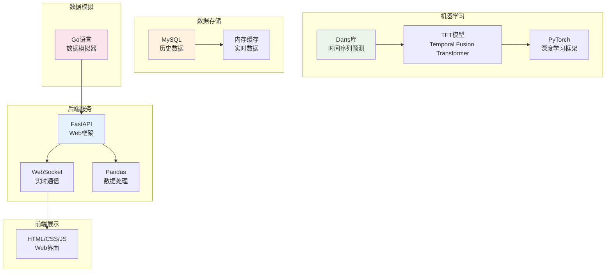
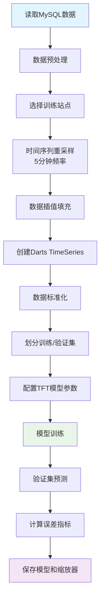
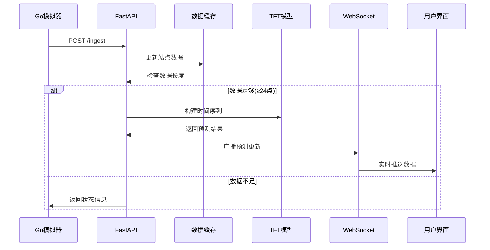
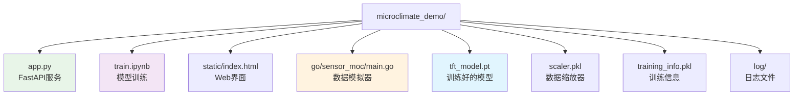
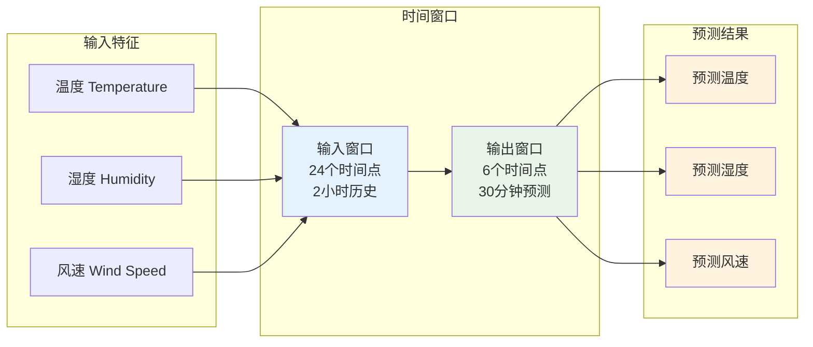

# 微气候预测项目架构图

## 1. 系统整体架构图

## 2. 数据流程图

## 3. 技术栈图

## 4. 模型训练流程图

## 5. 实时预测流程图

## 6. 项目文件结构图

## 7. 数据特征图

## 项目特点总结

1. **完整的数据管道**: 从历史数据训练到实时预测
2. **先进的时间序列模型**: 使用TFT (Temporal Fusion Transformer)
3. **实时预测服务**: FastAPI + WebSocket实现实时推送
4. **多站点支持**: 支持多个南极气象站的数据
5. **数据模拟工具**: Go语言编写的传感器数据模拟器
6. **Web界面展示**: 直观的数据可视化界面
