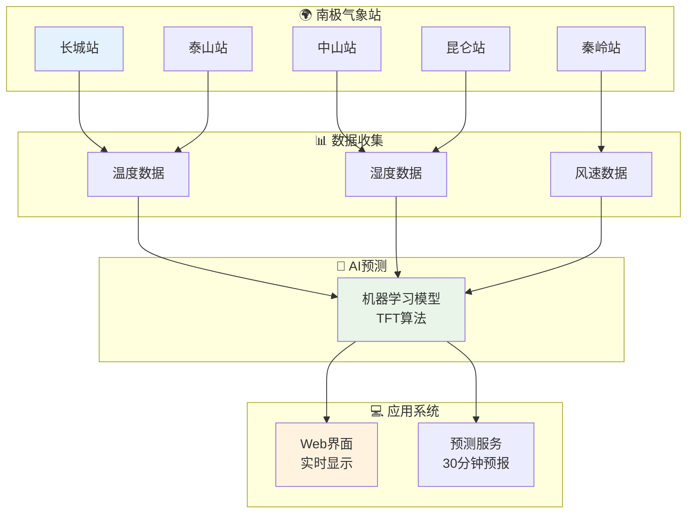
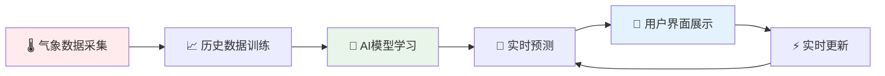
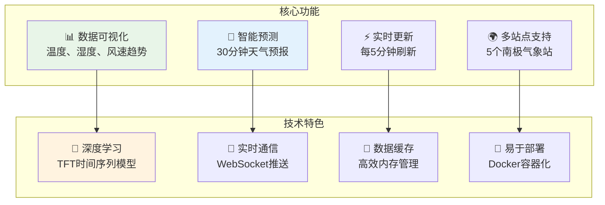
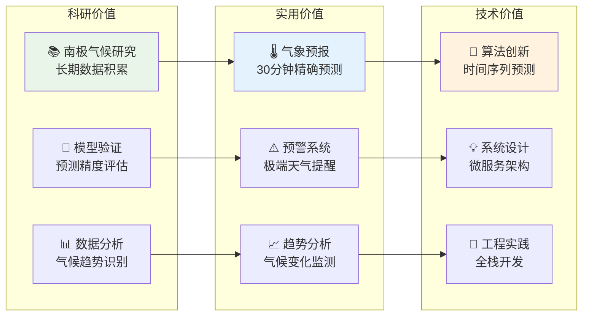
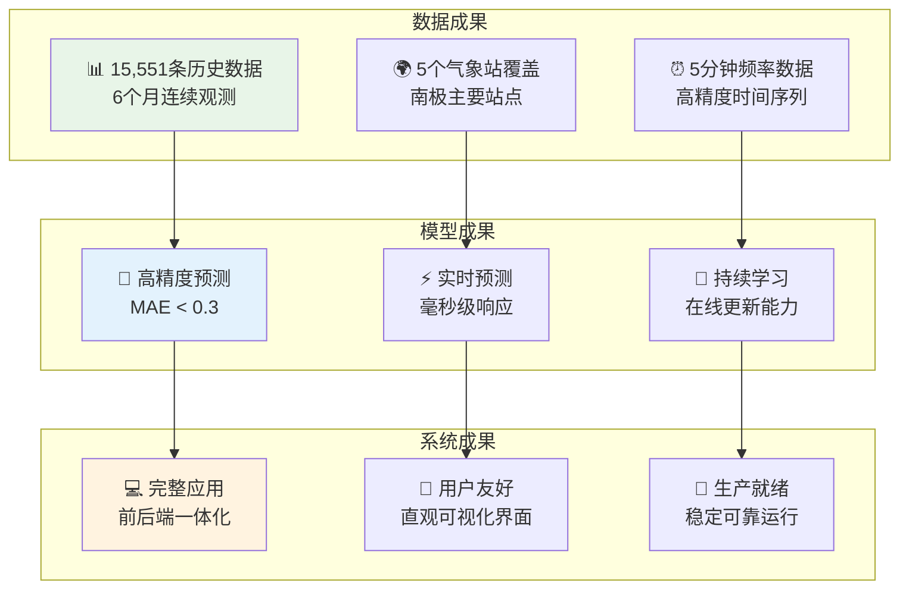
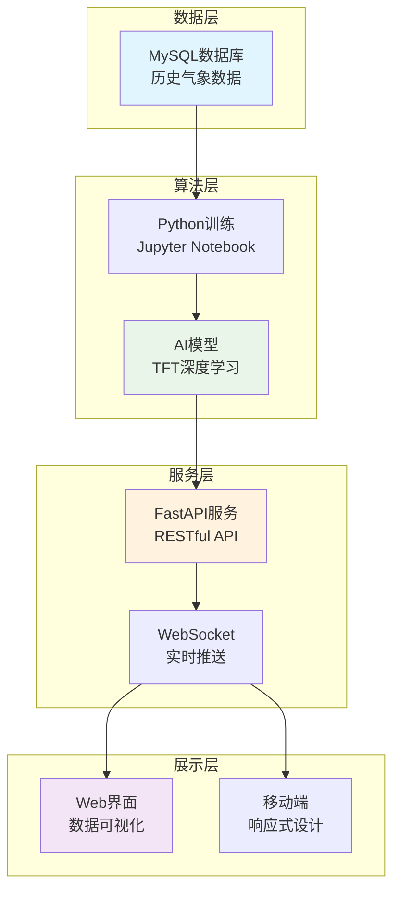

# 微气候预测项目概览

## 1. 项目简介图

## 2. 业务流程图

## 3. 系统功能图

## 4. 用户价值图

## 5. 项目成果图

## 6. 技术架构简化图

## 项目亮点总结

### 🌟 技术创新
- **先进算法**: 使用TFT (Temporal Fusion Transformer) 进行多变量时间序列预测
- **实时系统**: WebSocket实现毫秒级数据推送
- **智能缓存**: 内存缓存机制提高系统性能

### 📊 数据价值
- **丰富数据**: 15,551条南极气象站历史数据
- **多站点**: 覆盖5个主要南极气象站
- **高精度**: 5分钟频率的连续观测数据

### 💡 应用价值
- **科研支持**: 为南极气候研究提供预测工具
- **实用功能**: 30分钟精确天气预报
- **用户友好**: 直观的Web界面和实时更新

### 🚀 工程价值
- **完整系统**: 从数据训练到实时预测的完整流程
- **易于部署**: 模块化设计，支持容器化部署
- **可扩展性**: 支持添加新站点和新特征
