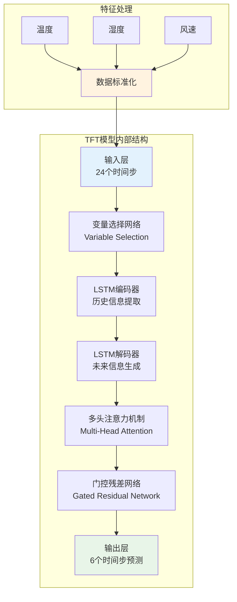
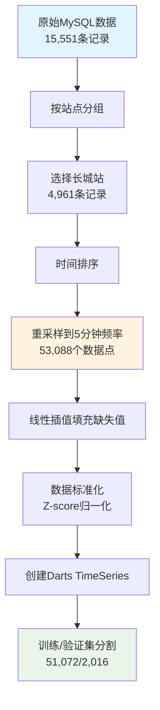
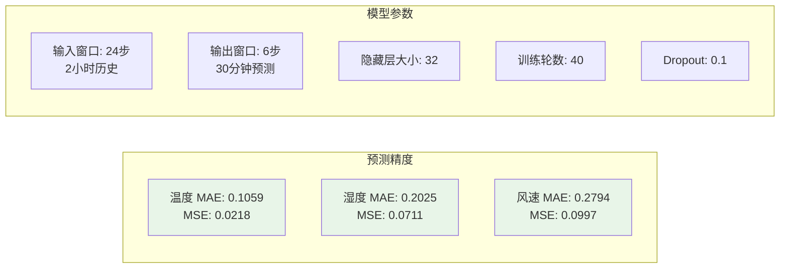
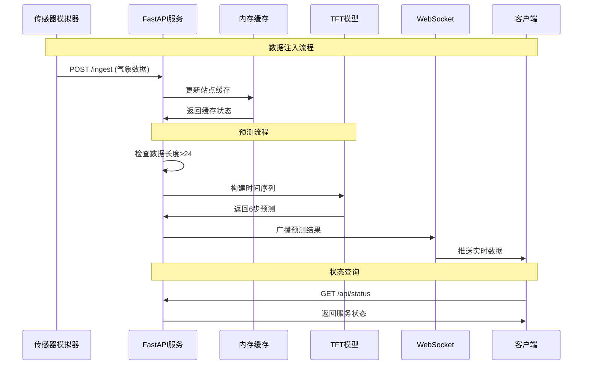
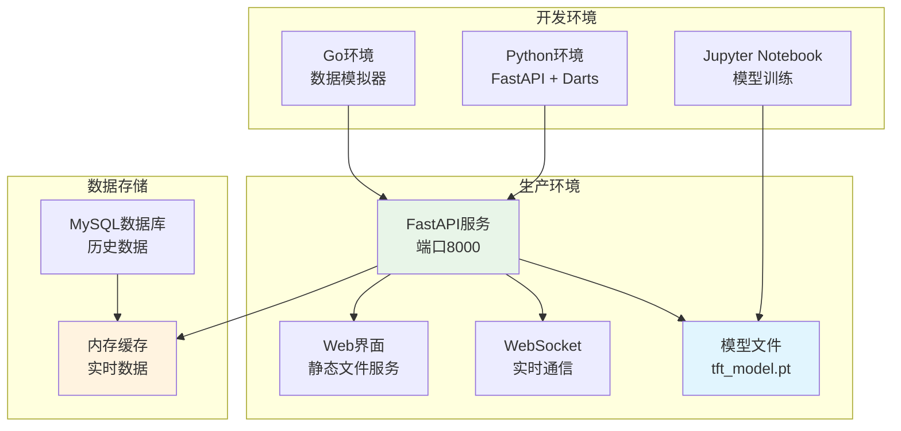
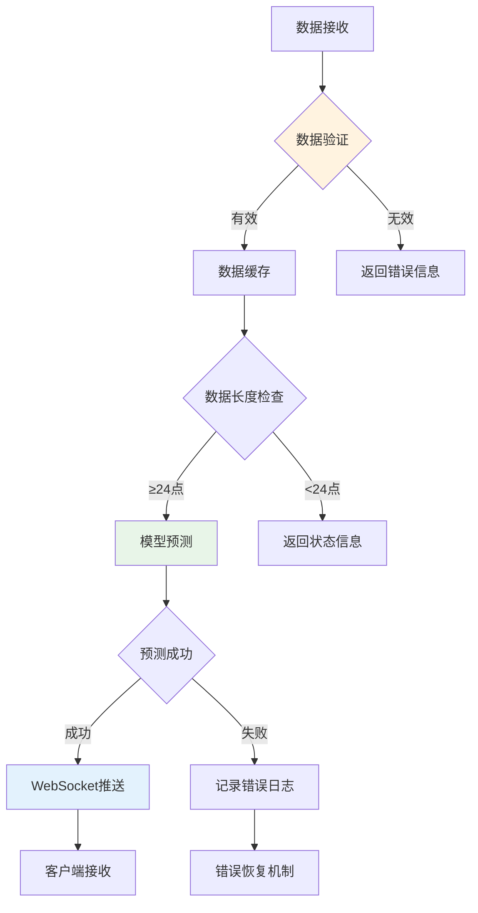
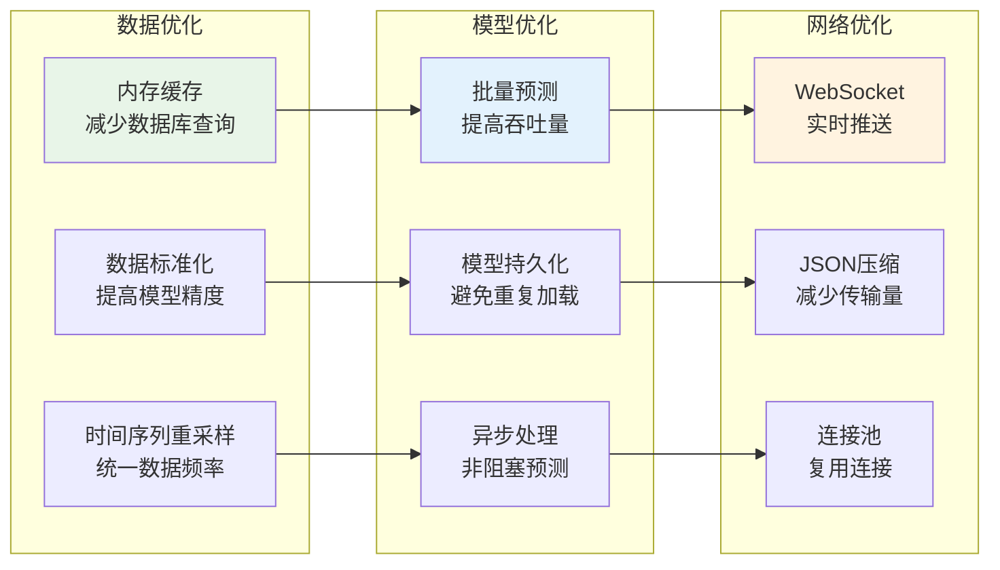

# 微气候预测项目技术详解

## 1. 核心算法架构图



## 2. 数据预处理流程图



## 3. 模型性能指标



## 4. API接口设计图

```mermaid
graph TB
    subgraph "REST API"
        A[POST /ingest<br/>数据注入]
        B[GET /api/status<br/>服务状态]
        C[GET /predictions/{station}<br/>获取预测]
        D[GET /stations<br/>站点信息]
        E[GET /<br/>Web界面]
    end
    
    subgraph "WebSocket"
        F[/ws<br/>实时推送]
    end
    
    subgraph "数据格式"
        G[WeatherData<br/>station, record_time<br/>temperature, humidity<br/>wind_speed]
    end
    
    A --> G
    F --> G
    
    style A fill:#e3f2fd
    style F fill:#e8f5e8
    style G fill:#fff3e0
```

## 5. 实时数据流图



## 6. 部署架构图



## 7. 错误处理机制



## 8. 性能优化策略



## 技术亮点

1. **先进的时间序列模型**: TFT (Temporal Fusion Transformer) 能够处理多变量时间序列
2. **实时预测系统**: 基于WebSocket的实时数据推送
3. **多站点支持**: 支持多个南极气象站的独立预测
4. **完整的数据管道**: 从历史数据训练到实时预测的完整流程
5. **高性能架构**: 内存缓存 + 异步处理 + 批量预测
6. **易于扩展**: 模块化设计，便于添加新的气象站或特征
